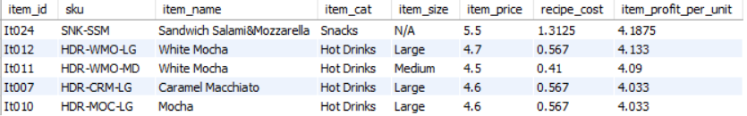
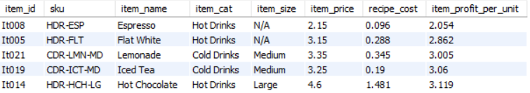
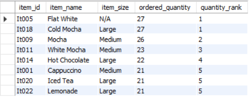
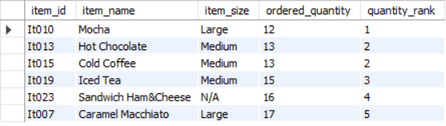
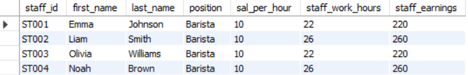
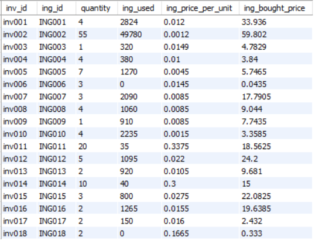

# CoffeeShopEDA
You can see all the data details at [https://www.kaggle.com/datasets/viramatv/coffee-shop-data](https://www.kaggle.com/datasets/viramatv/coffee-shop-data)

## Create Staging Tables
First, I created staging tables for every tables, so that I can alter tables without affecting the original tables.

Create new table with the same columns as the original.

```sql
CREATE TABLE orders_staging LIKE orders;
```

Insert all data from original table to new table.

```sql
INSERT orders_staging
SELECT *
FROM orders;
```

See the results

```sql
SELECT *
FROM orders_staging;
```

## Data Cleaning
### Check Duplicates
We check duplicates by using ROW_NUMBER () with PARTITION BY [column that shouldn't have the same values]. the duplicated rows will gave row_num greater than 1

```sql
WITH check_duplicates AS
(
SELECT *, ROW_NUMBER() OVER(PARTITION BY staff_id) AS row_num
FROM staff_staging
)
SELECT *
FROM check_duplicates
WHERE row_num > 1;
```

For orders_staging table some rows can have duplicated order_id(different items with the same recipt). So we check duplicated by order_id and item_id.

```sql
WITH check_duplicates AS
(
SELECT *, ROW_NUMBER() OVER(PARTITION BY order_id, item_id) AS row_num
FROM orders_staging
)
SELECT *
FROM check_duplicates AS c1
INNER JOIN check_duplicates AS c2 ON c1.order_id = c2.order_id AND c1.item_id = c2.item_id
WHERE c1.row_num = 1 AND c2.row_num > 1;
```

Result

As you can see ORD041 has two It011 within the recipt, and it was created at the same time. So we will delete the duplicated row, and add the quantity by 1.

```sql
-- Update orders quantity
UPDATE orders_staging
SET quantity = 2
WHERE row_id = 59 AND order_id = "ORD041";

-- Delete duplicated orders
DELETE
FROM orders_staging
WHERE row_id = 60 AND order_id = "ORD041";
```

### Standardize the Data
We want to make sure that the same data has the same values.

Find unique values for each column in every tables. Use ORDER BY to make similar values being near to each others, so we can see and standardize them.

```sql
SELECT DISTINCT ing_name
FROM ingredients_staging
ORDER BY 1;
```

### Null Values or Empty Values
There are empty values at column in_and_out on table orders_staging. However those values are empty because there is a row with the same order_id but different item_id that already has in_and_out value, so there is no need to make it not empty as that would be redundant.

See the same order_id within the same row
```sql
SELECT o1.order_id, o1.item_id, o1.in_or_out, o2.order_id, o2.item_id, o2.in_or_out
FROM orders_staging o1
JOIN orders_staging o2 ON o1.order_id = o2.order_id AND o1.item_id <> o2.item_id;
```


There is a cell that's suppose to be empty but is not. We already know that ORD006 is "in" from ORD006 with item_id It001, so in_and_out at ORD006 with item_id It016 should be empty.

```sql
UPDATE orders_staging
SET in_or_out = ""
WHERE order_id = "ORD006" AND item_id = "It016";
```

## Basic EDA
### Profit Per Unit for Each Items

Each Items has recipe and each recipes has required ingredients which are the cost of each items. We wanted to know the price of all the required ingredients to make a unit of each items, and calculate profit per unit. First we calculate price per unit for each ingredients, then calculate each ingredients cost for each recipes, sum ingredients price to get the total cost for each recipes, and calculate profit per unit from item_price - recipe_cost

**Top 5 Most Profitable Items**

```sql
SELECT *
FROM items_staging_1
ORDER BY item_profit_per_unit DESC
LIMIT 5;
```



**Top 5 Least Profitable Items**

```sql
SELECT *
FROM items_staging_1
ORDER BY item_profit_per_unit
LIMIT 5;
```



### Items Ordered Quantity

See how many times each items has been ordered. From orders_staging table we group by column item_id and sum up the quantity, then join with the table items_staging_1.

**Top 5 Most Ordered Item**

```sql
WITH ordered_ranking AS
(
SELECT item_id, item_name, item_size, ordered_quantity, 
dense_rank() OVER (ORDER BY ordered_quantity DESC) AS quantity_rank
FROM items_staging_2
)
SELECT * FROM ordered_ranking
WHERE quantity_rank <= 5;
```



**Top 5 Least Ordered Item**

```sql
WITH ordered_ranking AS
(
SELECT item_id, item_name, item_size, ordered_quantity, 
dense_rank() OVER (ORDER BY ordered_quantity) AS quantity_rank
FROM items_staging_2
)
SELECT * FROM ordered_ranking
WHERE quantity_rank <= 5;
```



### Staff Work Hours

We want to know how much total hours each staff has to do. First we calculate work hours by substracting start_time from end_time in shift_staging table and join it with rota_staging table. Then group by staff_id to sum up work_hours, and join with staff_staging table. We can also calculate staff_earning by sal_per_hour * staff_work_hours.

```sql
SELECT *, sal_per_hour * staff_work_hours AS staff_earnings
FROM staff_staging_1;
```



### How much have we bought each ingredients?

From all the ingredients that have been used for the orders, and the ingredients we have left in the inventory. We want to know how much have we used each ingredients. From how much ingredients we have left in the inventory and how much ingredients have been used, we can calculate the price that we bought each ingredients.

```sql
SELECT * FROM inventory_staging_1;
```



### Cost And Earning

Calculate cost and earning from 2024-02-12 to 2024-02-17 (Monday - Saturday). We'll calculate staffs total payment and ingredients total cost, then calculate total earning that we got from each item's orders.

**calculate total staffs payment**

```sql
SELECT SUM(sal_per_hour * staff_work_hours) AS staff_payment
FROM staff_staging_1;
```

staff_payment = 960

**calculate ingredients total cost**

```sql
SELECT ROUND(SUM(ing_bought_price), 4) AS ing_total_cost
FROM inventory_staging_1;
```

ing_total_cost = 258.0169

**calculate total earning**

```sql
SELECT ROUND(SUM(item_price * ordered_quantity), 4) AS item_total_earning
FROM items_staging_2;
```

item_total_earning = 1857.45

**calculate profit**

profit = 1857.45 - (960 + 258.0169) = 639.4331